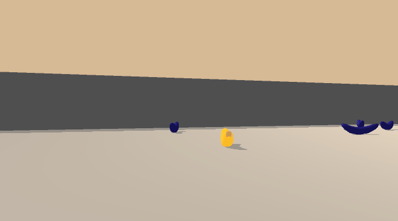
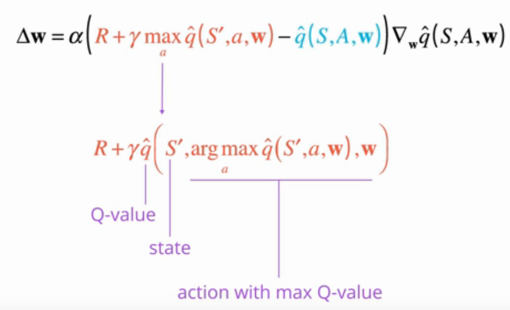
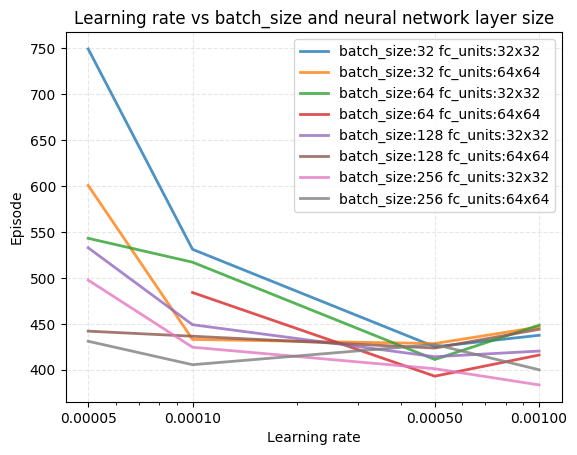
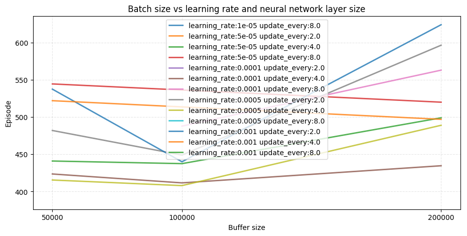
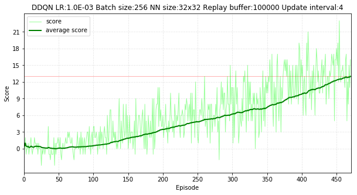

# Project: Banana collector

## Contents
- [Introduction](#Introduction)
  * [Problem definition](#Problem-definition)
- [Background](#Background)
  * [DQN algorithm](#DQN-algorithm)
  * [DDQN algorithm](#DDQN-algorithm)
- [Implementation](#Implementation)
- [Hyperparameter tuning](#Hyperparameter-tuning)
- [Result](#Result)
- [Future work](#Future-work)
- [References](#References)

# Introduction

In this project, DQN agent was implemented to navigate and collect bananas in a Unity's [Banana Collector](https://github.com/Unity-Technologies/ml-agents/blob/master/docs/Learning-Environment-Examples.md#banana-collector) world.  

    

## Problem definition

A reward of +1 is provided for collecting a yellow banana, and a reward of -1 is provided for collecting a blue banana.  Thus, the goal of the agent is to collect as many yellow bananas as possible while avoiding blue bananas.  

The state space has 37 dimensions and contains the agent's velocity, along with ray-based perception of objects around agent's forward direction.  Given this information, the agent has to learn how to best select actions.  Four discrete actions are available, corresponding to:
- **`0`** - move forward.
- **`1`** - move backward.
- **`2`** - turn left.
- **`3`** - turn right.

The task is episodic, and scoring average score of +13 over 100 consecutive episodes is considered solving the environment.

# Background

DQN(Deep Q-Networks) uses Neural Network that approximates Q-values based on environment's current state as input. This makes it not only possible to approximate large state space environments, which is not feasible with traditional table based Reinforcement Learning methods, but also it brings superhuman performance in some environments.

## DQN algorithm
Just replacing tables with neural network alone is not sufficient for excellent performance. According to original [DQN paper](https://web.stanford.edu/class/psych209/Readings/MnihEtAlHassibis15NatureControlDeepRL.pdf), it takes couple of techniques and tricks in order to reach human level performance. Two of the most impactful techniques are: Experience replay and Fixed Q-target.

By using these techniques DQN algorithm's sampling and learning becomes separated as shown in below:

    

## DDQN algorithm
DDQN(Double DQN) algorithm improves original DQN' algorithm's performance by eradicating its overestimation bias problem. In the paper "Deep Reinforcement Learning with Double Q-learning", it is shown that overestimation bias is resulted from using same Q-Network parameters for both selecting and evaluating next action as shown below.

    

Double Q Learning solves this issue by using DQN's target Q-Network's parameters when evaluating target value.

    

# Implementation

PyTorch based implementation of DQN agent from Udacity's Deep Reinforcement Learning nanodegree course's GitHub [page](https://github.com/udacity/deep-reinforcement-learning/tree/master/dqn/solution) was used as a baseline code. Original source code was intended for solving OpenAI gym's Lunar Lander problem with vanilla DQN algorithms.

In this project, Agent is modified to solve Unity's [Banana Collector](https://github.com/Unity-Technologies/ml-agents/blob/master/docs/Learning-Environment-Examples.md#banana-collector) world. To improve the efficiently of the agent, Double DQN algorithm was used.

Full implementation of Double DQN agent can be found in [ddqn_agent.py](https://github.com/Zulkhuu/reinforcement-learning/tree/master/BananaCollector/agents/ddqn_agent.py) file.

 Other improvements over DQN algorithms such as: Prioritized Experience Replay and Dueling Q Networks are planned to be added in future.

# Hyperparameter tuning

To get best result from the agent, it is important to find optimal values for some of the hyperparameters such as learning rate, batch size and replay buffer size.
In order to tune those hyperparameters, A hyperparameter optimization framework [Optuna](https://optuna.org/) was used. Since Optuna framework comes as a native Python package, it can be integrated effortlessly with current implementation.

Hyperparameter tuning was run with following setup:

- Objective function to minimize:
  - Number of episodes that it takes to solve the environment
- Hyperparameters:
  - Learning rate with search space of [5e-5 to 1e-4]
  - Batch size with search space of [32, 64, 128, 256]
  - Q-network size with search space of [32, 64]
  - Replay buffer size with search space of [50k, 100k, 200k]
  - Update interval with search space of [2, 4, 8]

Since agent's performance depends on random initialization, same parameter configuration will be run multiple times and its mean value will be evaluated.

Detailed implementation can be found in [hyperparameter_tuning.py](https://github.com/Zulkhuu/reinforcement-learning/tree/master/BananaCollector/utils/hyperparameter_tuning.py) file.

# Result

## Learning rate vs Batch size and Neural Network size

Below image shows the relation between learning rate, batch size and neural network size.

    

Overall larger batch size tends to result in better result and can handle larger learning rate. Only when the batch size is 256, performance improves when learning rate increase from 0.0005 to 0.001. It is reasonable to think that smaller batch sizes can not handle larger learning rate due to noise.

Larger neural network with size of 64 nodes in each layer performs better than smaller network when learning rate is between [5e-5 to 1e-4]. But when the learning rate increases it becomes difficult to tell which one is better.

Best combination in this case is batch size of 256, learning rate of 0.001 and Q-network with 32 nodes in each layer.

## Buffer size vs Learning rate and Update interval

Below image shows the relation between learning rate, replay buffer size and update interval.

    

Almost all combination of learning rate and update interval got their best performance when buffer size is 100000. Thus, buffer size of 100000 seems to be optimal value and increasing or decreasing buffer size results in much poorer performance.

Also update interval of 4 seems to be optimal as evidenced by bottom(best) three curve corresponds to update interval of 4.

Based on above observation, following hyperparameter values were chosen as optimal value.
- Learning rate: 0.001
- Batch size: 256
- Buffer size: 100000
- Update interval: 4
- Neural network size: 32

Training agent with above hyperparameter values, solves the environment in 371 episodes. Each episode's score and average score during training is shown below:

    

# Future work

Implement recent algorithms that improve DQN agent's performance.
- Dueling Network Architectures for Deep Reinforcement Learning [[arxiv]](https://arxiv.org/abs/1511.06581)
- Prioritized Experience Replay [[arxiv]](https://arxiv.org/abs/1511.05952)
- Noisy Networks for Exploration [[arxiv]](https://arxiv.org/abs/1706.10295)
- Rainbow: Combining Improvements in Deep Reinforcement Learning [[arxiv]](https://arxiv.org/abs/1710.02298)
- Distributional Reinforcement Learning with Quantile Regression [[arxiv]](https://arxiv.org/pdf/1710.10044)
- Neural Episodic Control [[arxiv]](https://arxiv.org/pdf/1703.01988)

# References

- [Human-level control through deep reinforcement learning](http://www.nature.com/nature/journal/v518/n7540/full/nature14236.html)
- [Deep Reinforcement Learning with Double Q-learning](https://arxiv.org/abs/1509.06461)
- [Reinforcement Learning: An Introduction](http://incompleteideas.net/book/the-book-2nd.html)
- [Deep RL Bootcamp](https://sites.google.com/view/deep-rl-bootcamp/lectures)
- [Deep Reinforcement Learning UC Berkeley](http://rail.eecs.berkeley.edu/deeprlcourse/)
- [Udacity Deep Reinforcement Learning Nanodegree program](https://www.udacity.com/course/deep-reinforcement-learning-nanodegree--nd893)
