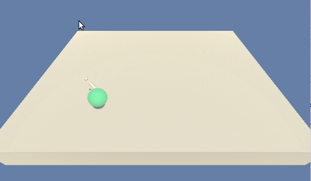

# Project: Continuous Control

### Introduction

In this project, DDPG based agent was implemented to control robotics manipulator with two joints to reach goal location in Unity's [Reacher](https://github.com/Unity-Technologies/ml-agents/blob/master/docs/Learning-Environment-Examples.md#reacher) environment.

    

In this environment, a double-jointed arm can move to target locations. A reward of +0.1 is provided for each step that the agent's hand is in the goal location. Thus, the goal of the agent is to maintain its position at the target location for as many time steps as possible.

The observation space consists of 33 variables corresponding to position, rotation, velocity, and angular velocities of the arm. Each action is a vector with four numbers, corresponding to torque applicable to two joints. Every entry in the action vector should be a number between -1 and 1.

The task is episodic, and in order to solve the environment, agent must get an average score of +30 over 100 consecutive episodes.

### Prerequisites

1. Clone the [root repository](https://github.com/Zulkhuu/reinforcement-learning/tree/master) and install its dependencies.

2. Download the environment from one of the links below.  You need only select the environment that matches your operating system:

- Linux: [click here](https://s3-us-west-1.amazonaws.com/udacity-drlnd/P2/Reacher/one_agent/Reacher_Linux.zip)
- Mac OSX: [click here](https://s3-us-west-1.amazonaws.com/udacity-drlnd/P2/Reacher/one_agent/Reacher.app.zip)
- Windows (32-bit): [click here](https://s3-us-west-1.amazonaws.com/udacity-drlnd/P2/Reacher/one_agent/Reacher_Windows_x86.zip)
- Windows (64-bit): [click here](https://s3-us-west-1.amazonaws.com/udacity-drlnd/P2/Reacher/one_agent/Reacher_Windows_x86_64.zip)

3. Place the file in the cloned reinforcement-learning repository's' `Reacher/` folder, and unzip (or decompress) the file.

### Instructions

Follow the instructions in [`Reacher.ipynb`](Reacher.ipynb) to get started with training your the agent or watch already trained agent running!

## Documentation

See the detailed project report from [Report.md](docs/Report.md) file.
