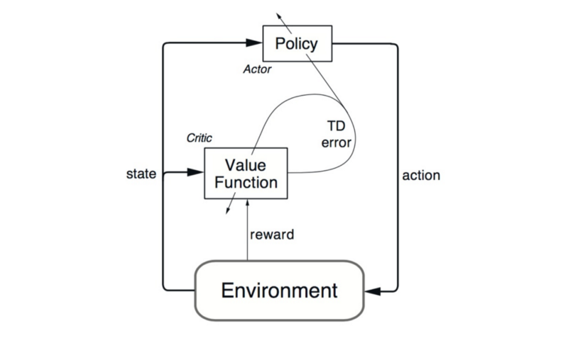
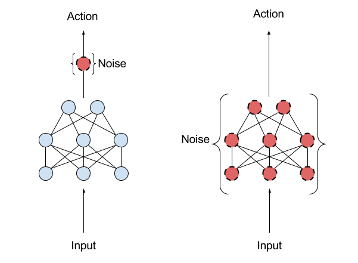
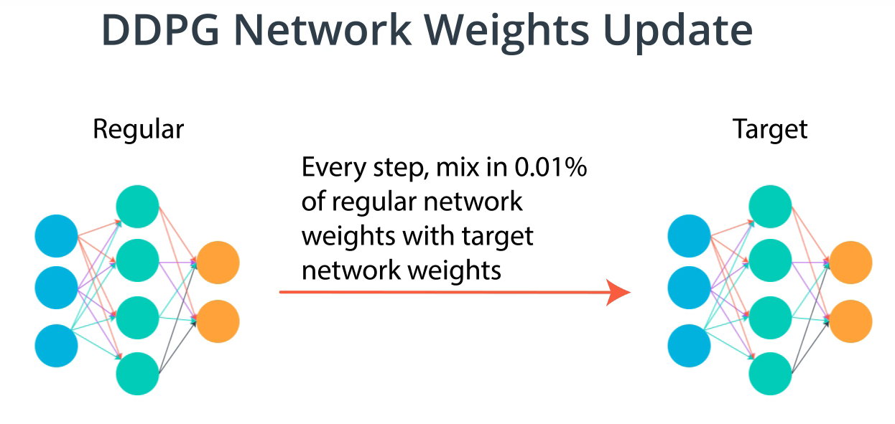
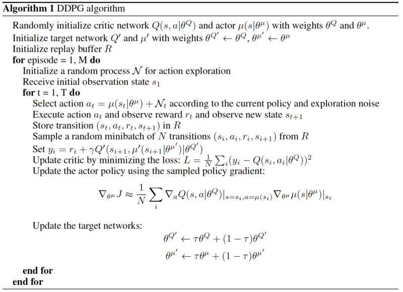
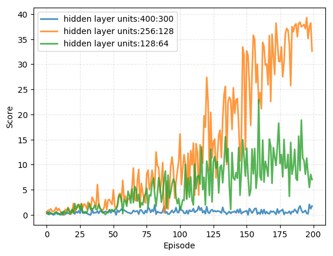
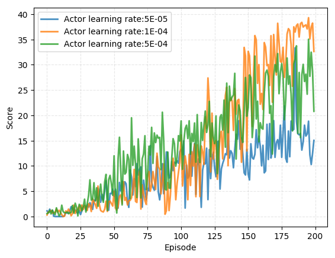
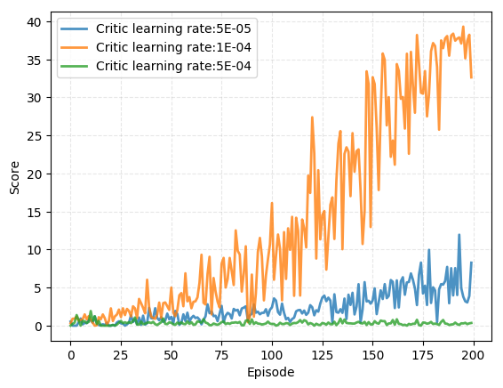
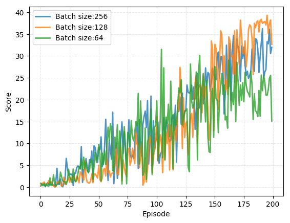
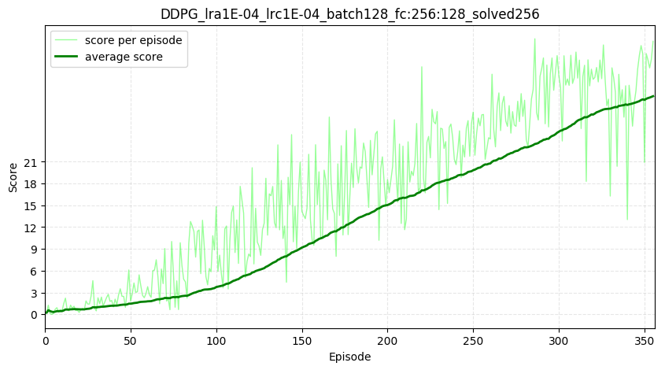

# Project: Reacher

## Contents
- [Introduction](#Introduction)
  * [Problem definition](#Problem-definition)
- [Background](#Background)
  * [DDPG algorithm](#DDPG-algorithm)
- [Implementation](#Implementation)
- [Hyperparameter tuning](#Hyperparameter-tuning)
- [Result](#Result)
- [Future work](#Future-work)
- [References](#References)

# Introduction

In this project, DDPG(Deep Deterministic Policy Gradient) agent was implemented to control robotic arm in a Unity's [Reacher](https://github.com/Unity-Technologies/ml-agents/blob/master/docs/Learning-Environment-Examples.md#reacher) world.  

    

## Problem definition

In this environment, a double-jointed arm can move to target locations. A reward of +0.1 is provided for each step that the agent's hand is in the goal location. Thus, the goal of the agent is to maintain its position at the target location for as many time steps as possible.

The observation space consists of 33 variables corresponding to position, rotation, velocity, and angular velocities of the arm. Each action is a vector with four numbers, corresponding to torque applicable to two joints. Every entry in the action vector should be a number between -1 and 1.

The task is episodic, and in order to solve the environment, agent must get an average score of +30 over 100 consecutive episodes.

# Background

DQN(Deep Q Network) algorithms showed huge success in many environments such as the Atari game whose action space is discrete. However, there exists many practical problems whose action space is continuous and often it is not feasible to discretize the actions. In order to be able to solve problems in such environments, it requires more sophisticated algorithms.

## DDPG algorithm
DDPG is based on actor-critic architecture with two separate networks: actor network for learning the best policy and critic network for evaluating the current state.
Below image from [DDPG paper](https://arxiv.org/pdf/1509.02971.pdf) illustrates the actor-critic architecture:

    

A critic network is used for estimating the value function for current state and action selected by actor network. Since it is similar to DQN algorithm, DDPG borrows some ideas from DQN algorithm such as: Experience Replay and Fixed Q-Network.

Unlike DQN, DDPG do exploration by adding noise to its actions. Adding noise to its action is somewhat similar to evolution strategy as shown in below image taken from [OpenAI's blog](https://blog.openai.com/better-exploration-with-parameter-noise/) (Action space noise (left), compared to parameter space noise (right)):

    

Another new idea presented in DDPG paper is that, it doesn't directly copy weights to target network. Instead DDPG uses soft update to slowly track target network with small percentage as explained in below image from [Udacity's Deep RL nanodegree program](https://www.udacity.com/course/deep-reinforcement-learning-nanodegree--nd893):

    

In below image from [DDPG paper](https://arxiv.org/pdf/1509.02971.pdf), illustrates full DDPG algorithm utilizing above mentioned features:

    

# Implementation

PyTorch based implementation of DDPG agent from Udacity's Deep Reinforcement Learning nanodegree course's GitHub [page](https://github.com/udacity/deep-reinforcement-learning/tree/master/ddpg-pendulum) was used as a baseline code. Original source code was intended for solving OpenAI gym's Pendulum-v0 problem with DDPG algorithms.

In this project, Agent is modified to solve Unity's [Reacher](https://github.com/Unity-Technologies/ml-agents/blob/master/docs/Learning-Environment-Examples.md#reacher) world. To improve the efficiently of the agent, minimal hyperparameter tuning was done.

Full implementation of DDPG agent can be found in [ddpg_agent.py](https://github.com/Zulkhuu/reinforcement-learning/tree/master/Reacher/agents/ddpg_agent.py) file.

 Other actor-critic algorithms such as: A3C and PPO are planned to be added in future.

# Hyperparameter tuning

To get best performance from the agent, it is important to find optimal values for some of the hyperparameters such as batch_size, learning rate and network size for each of actor, critic networks.
In order to tune those hyperparameters, simple grid search was done with following inputs:

- Hyperparameters:
  - Hidden layer size for actor and critic networks with search space of [[400,300], [256, 128], [128, 64]]
  - Learning rate for actor networks with search space of [5e-5, 1e-4, 5e-4]
  - Learning rate for critic networks with search space of [5e-5, 1e-4, 5e-4]
  - Batch size with search space of [32, 64, 128, 256]

Since training takes long time, performance of certain parameter configuration will be run only for first 200 episodes.
Then based on previous experiment, best performing parameter values were selected for training further to solve the environment.

Detailed implementation of the hyperparameter tuning can be found in [hyperparameter_tuning.py](https://github.com/Zulkhuu/reinforcement-learning/tree/master/Reacher/utils/hyperparameter_tuning.py) file.

# Result

## Actor and Critic network's hidden layer size

Below graph shows how Actor and Critic network's hidden layer size affects the learning process.

    

Based on above graph, hidden layer size of 400x300 seems to be too large, and taking long time to learn. On the other hand, hidden layer size of 128x64 started learning well, but starts to drop around episode 180-200. Hidden layer size of 256x128 seems to be optimal value.

## Learning rate of actor network

Below graph shows the scores during training with different learning rate of actor.

    

When learning rate is 5E-04, agent was learning faster in the beginning, but looks stabilized around 25-30 from episode 150. Learning rate of 1E-04(0.0001) seems to be learning even further as learning continues.

## Learning rate of critic networks

Below graph shows the scores during training with different learning rate of critic networks.

    

Increasing or decreasing the learning rate from 1E-04(0.0001) resulted in poorer performance. Learning rate from 1E-04 seems to be optimal.

## Batch size

Below graph shows the scores during training with different batch sizes.

    

When batch size is 256 or 64, agent was learning faster in the beginning, but looks stabilized around score of 30 and 20 respectively. On the other hand, batch size of 128 seems to be achieving relatively higher score around 35 as learning continues beyond episode 200.

Based on above observation, following hyperparameter values were chosen as optimal value.
- Learning rate for actor networks 1E-04
- Learning rate for critic networks 1E-04
- Hidden layer size for actor networks [256, 128]
- Hidden layer size for critic networks [256, 128]
- Batch size with search space of 128

Training agent with above hyperparameter values, solves the environment in 256 episodes. Each episode's score and average score during training is shown below:

    

# Future work

- Run current implementation with 20 agents.
- Implement state of the art actor-critic algorithms.
  - Asynchronous Methods for Deep Reinforcement Learning [[paper]](https://arxiv.org/pdf/1602.01783.pdf)
  - Proximal Policy Optimization Algorithms [[paper]](https://arxiv.org/pdf/1707.06347.pdf)

# References

- [Continuous control with Deep Reinforcement Learning](https://arxiv.org/pdf/1509.02971.pdf)
- [Better Exploration with Parameter Noise](https://blog.openai.com/better-exploration-with-parameter-noise/)
- [Reinforcement Learning: An Introduction](http://incompleteideas.net/book/the-book-2nd.html)
- [Deep Reinforcement Learning UC Berkeley](http://rail.eecs.berkeley.edu/deeprlcourse/)
- [Deep RL Bootcamp](https://sites.google.com/view/deep-rl-bootcamp/lectures)
- [Advanced Deep Learning & Reinforcement Learning](https://www.youtube.com/watch?v=iOh7QUZGyiU&list=PLqYmG7hTraZDNJre23vqCGIVpfZ_K2RZs)
- [Udacity Deep Reinforcement Learning Nanodegree program](https://www.udacity.com/course/deep-reinforcement-learning-nanodegree--nd893)
