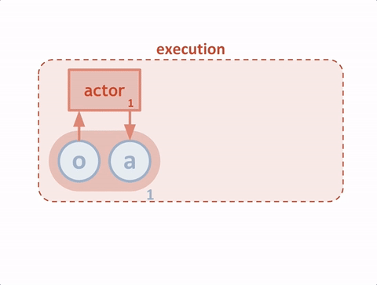
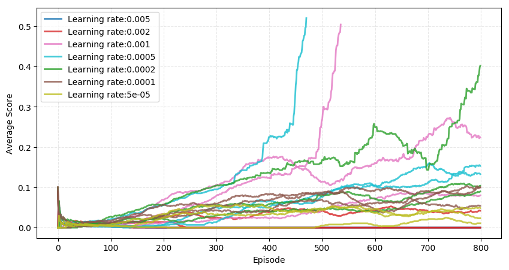
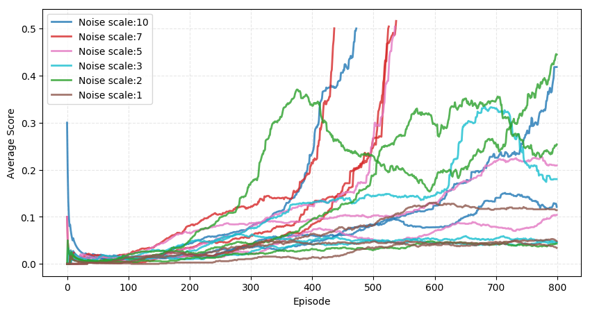
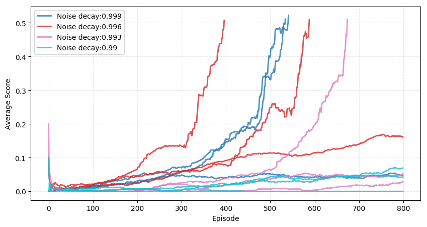
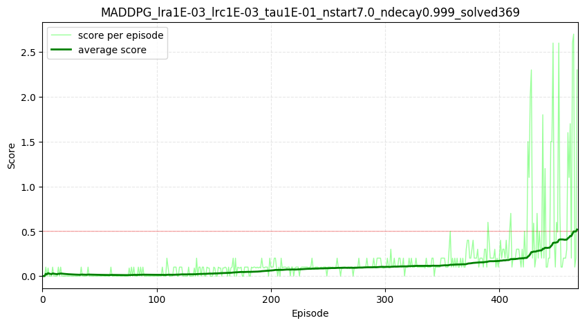

# Project: Tennis

## Contents
- [Introduction](#Introduction)
  * [Environment](#Environment)
- [Background](#Background)
  * [MADDPG algorithm](#MADDPG-algorithm)
- [Implementation](#Implementation)
- [Hyperparameter tuning](#Hyperparameter-tuning)
- [Result](#Result)
- [Future work](#Future-work)
- [References](#References)

# Introduction

In this project, MADDPG(Multi Agent Deep Deterministic Policy Gradient) agent was implemented to solve environment similar to Unity's [Tennis](https://github.com/Unity-Technologies/ml-agents/blob/master/docs/Learning-Environment-Examples.md#tennis) environment.

  

## Environment

In this environment, two agents control rackets to bounce a ball over a net. If an agent hits the ball over the net, it receives a reward of +0.1.  If an agent lets a ball hit the ground or hits the ball out of bounds, it receives a reward of -0.01.  Thus, the goal of each agent is to keep the ball in play.

The observation space consists of 8 variables corresponding to the position and velocity of the ball and racket. Each agent receives its own, local observation.  Two continuous actions are available, corresponding to movement toward (or away from) the net, and jumping.

The task is episodic, and in order to solve the environment, your agents must get an average score of +0.5 (over 100 consecutive episodes, after taking the maximum over both agents). Specifically,

- After each episode, we add up the rewards that each agent received (without discounting), to get a score for each agent. This yields 2 (potentially different) scores. We then take the maximum of these 2 scores.
- This yields a single **score** for each episode.

The environment is considered solved, when the average (over 100 episodes) of those **scores** is at least +0.5.

# Background

Most straightforward approach to learning in multi-agent environment is to train independently learning agents. However both value based and policy gradient methods perform bad in such situations. One issue is that agent’s policy changes during training, resulting in a non-stationary environment and preventing the naïve application of experience replay according to the [Multi Agent DDPG paper](https://arxiv.org/pdf/1706.02275.pdf).

## MADDPG algorithm

Multi Agent Deep Deterministic Policy Gradient(MADDPG) algorithm addresses those challenges faced by multi-agent learning by adapting DDPG algorithm to use in multi-agent setting.
Novelty of MADDPG algorithm lies in its centralized training and decentralized execution paradigm. As shown in below image, critic of each agent observes the environment fully, while actor acts based on only its own observation.

  

Another difference from using independent agents, is that MADDPG uses shared replay buffer between agents which holds full environment states, and each agents actions and rewards. Below image illustrates full MADDPG algorithm:

  

# Implementation

Implementation uses [Reacher project](https://github.com/Zulkhuu/reinforcement-learning/tree/master/Reacher)'s DDPG Implementation as a baseline. Main changes done to regular DDPG agent implementation are:
- Agents use shared common replay buffer
- Each agent's critic receives full state observation for evaluating the state value while actor uses only its own observation for choosing the action.
- Improve exploration early in the beginning by increasing the action space noise's amplitude and decay it to zero as training continues.

Full implementation of MADDPG agent can be found in [maddpg_agent.py](https://github.com/Zulkhuu/reinforcement-learning/tree/master/Tennis/agents/maddpg_agent.py) file.

# Hyperparameter tuning

Most of the hyperparameters were selected same as Reacher project as networks are similar.
Batch size, replay buffer size and network sizes were selected same as previous project.

During tuning hyperparameter values, it was noticed that good exploration in the beginning was crucial to the how learning continues.
It seems that if agent finds good policy early in the training, then it keeps on improving that policy and eventually solves the environment. If agent doesn't find good policy in the beginning, as exploration noise amplitude decays, it becomes harder to find good policy.

Since initial action depends on exploration by noise, even with same hyperparameter settings, training results on different outputs. Even the hyperparameter values which is considered good sometimes results in divergence. Thus, training was executed multiple times to evaluate certain hyperparameter value.

In order to save computation time, training was executed for maximum of 800 episodes and terminates if environment is solved.

Detailed implementation of the hyperparameter tuning can be found in [hyperparameter_tuning.py](https://github.com/Zulkhuu/reinforcement-learning/tree/master/Tennis/utils/hyperparameter_tuning.py) file.

## Learning rate

Same learning rates were used for both actor and critic networks same as Reacher project. Result of trying multiple different learning rate is shown in below graph:

  

It looks like learning rate of 0.001 seems to be optimal value. It resulted much higher scores than smaller or larger learning rate values and solved the environment once in around 500 episodes.

## Soft update parameter (tau)

Trying different values of tau resulted in below graph:

  

It looks like larger value of tau resulted in better performance which indicates that target network needs to be updated much faster than previous Reacher environment.

## Noise scale

Trying different exploration noise scale resulted in below graph:

  

Noise scale of 7 seems to be optimal value that it resulted in solving environment 3 times out of 3 run.

## Noise decay

Trying different exploration noise decay value resulted in below graph:

  

Larger values of 0.999 and 0.996 seems to be encouraging agent to explore more and find good policy.

# Result

Based on above observation, following hyperparameter values were chosen as optimal value.
- Learning rate for actor networks 0.001
- Learning rate for critic networks 0.001
- Soft target update tau parameter of 0.1
- Exploration noise initial scale of 7
- Exploration noise decay of 0.999

Training agent with above hyperparameter values, solves the environment in as fast as 469 episodes. Each episode's score and average score during training is shown below:

    

When checking successfully trained agents, it looks agents learned a policy to do [defensive backspin chop](http://www.larrytt.com/ttsts/Step%2010%20-%20Chopping%20-%20Backspin%20Defense.pdf) and then move close to the net.
Trained agents are shown below(Also shown on top of the report):

  

# Future work

- Use MADDPG agent implementation to solve [Unity's Soccer Two environment](https://github.com/Unity-Technologies/ml-agents/blob/master/docs/Learning-Environment-Examples.md#soccer-twos).

# References

- [Multi-Agent Actor-Critic for Mixed Cooperative-Competitive Environments](https://arxiv.org/pdf/1706.02275.pdf)
- [Continuous control with Deep Reinforcement Learning](https://arxiv.org/pdf/1509.02971.pdf)
- [Better Exploration with Parameter Noise](https://blog.openai.com/better-exploration-with-parameter-noise/)
- [Reinforcement Learning: An Introduction](http://incompleteideas.net/book/the-book-2nd.html)
- [Deep Reinforcement Learning UC Berkeley](http://rail.eecs.berkeley.edu/deeprlcourse/)
- [Deep RL Bootcamp](https://sites.google.com/view/deep-rl-bootcamp/lectures)
- [Advanced Deep Learning & Reinforcement Learning](https://www.youtube.com/watch?v=iOh7QUZGyiU&list=PLqYmG7hTraZDNJre23vqCGIVpfZ_K2RZs)
- [Udacity Deep Reinforcement Learning Nanodegree program](https://www.udacity.com/course/deep-reinforcement-learning-nanodegree--nd893)
